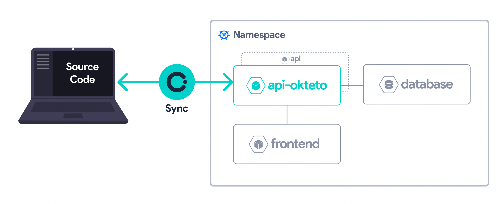

# Okteto: A Tool to Develop Applications on Kubernetes

## Overview

Kubernetes has made it very easy to deploy applications to the cloud at a higher scale than ever, but development practices have not evolved at the same speed as application deployment patterns.

Today, most developers try to either run parts of the infrastructure locally or just test their integrations directly in the cluster via CI jobs, or the _docker build/redeploy_ cycle. It works, but this workflow is painful and incredibly slow.

`okteto` accelerates the development workflow of Kubernetes applications. You write your code locally and `okteto` detects the changes and instantly updates your Kubernetes applications.

## How it works

Okteto enables development inside a container, providing a seamless IDE and tool integration as if you were working locally but with the resources of a remote cluster. When you run `okteto up` your Kubernetes deployment is replaced by a Development Container that contains your development tools (e.g. maven and jdk, or npm, python, go compiler, debuggers, etc). This development container can use any [docker image](https://okteto.com/docs/development/images/). The development container inherits the same secrets, configmaps, volumes or any other configuration value of the original Kubernetes deployment.

The end result is a remote cluster that is seen by your IDE and tools as a local filesystem/environment. You keep writing code on your local IDE and as soon as you save a file, the change goes to the development container, and your application instantly updates (taking advantage of any hot-reload mechanism you already have). This whole process happens in an instant. No docker images need to be created and no Kubernetes manifests need to be applied to the cluster.

## Why Okteto

`okteto` has several advantages when compared to more traditional development approaches:

- **Fast inner loop development**: build and run your application using your favorite tools directly from your development container. Native builds are always faster than the _docker build/redeploy_ cycle.
- **Realistic development environment**: your development container reuses the same variables, secrets, sidecars, volumes as your original Kubernetes deployment. Realistic environments eliminate integration issues.
- **Replicability**: development containers eliminate the need to install your dependencies locally, everything is pre-configured in your development image.
- **Unlimited resources**: get access to the hardware and network of your cluster when developing your application.
- **Deployment independent**: `okteto` decouples deployment from development. You can deploy your application with kubectl, Helm, a serverless framework, or even a CI pipeline and use `okteto up` to develop it. This is especially useful for cloud-native applications where deployment pipelines are not trivial.
- **Works anywhere**: `okteto` works with any Kubernetes cluster, local or remote. `okteto` is also available for macOS, Linux, and Windows.

## Getting started

All you need to get started is to [install the Okteto CLI](https://www.okteto.com/docs/get-started/install-okteto-cli/) and have access to a Kubernetes cluster. You can follow our [guide for setting up a Kubernetes cluster on AWS here](https://www.okteto.com/docs/get-started/install/amazon-eks/#deploy-a-kubernetes-cluster).

### Okteto Open Source CLI Features

The Okteto Open Source CLI requires access to a Kubernetes cluster. The Okteto Open Source CLI aims to enable you to develop your cloud-native applications using Development Containers in your Kubernetes clusters. If you are interested in helping your entire team share a Kubernetes cluster for development, we recommend you check out our commercial product, the [Okteto Platform](https://okteto.com)

The Okteto Open Source CLI supports the following commands:

- `okteto context`
- `okteto up`
- `okteto down`

> [!NOTE]
> ⚠️ Notice: The open-source version of Okteto only supports the [dev section](https://www.okteto.com/docs/reference/okteto-manifest/#dev-object-optional) of the Okteto manifest. For additional features and full functionality, consider exploring the [Okteto Platform](https://www.okteto.com/get-demo/).

We have getting started guides for the Open Source mode for the following languages:

- [ASP.NET](samples/aspnetcore/README.md)
- [Golang](samples/golang/README.md)
- [Java Gradle](samples/java-gradle/README.md)
- [Java Maven](samples/java-maven/README.md)
- [Node.js](samples/node.js/README.md)
- [PHP](samples/php/README.md)
- [Python](samples/python/README.md)
- [Ruby](samples/ruby/README.md)

### Okteto Platform CLI Features

The Okteto Platform CLI requires the installation of the [Okteto Helm Chart](https://www.okteto.com/docs/get-started/overview/) in your Kubernetes cluster. In this mode, all the Okteto CLI commands are available (`build`, `deploy`, `up`, `down`, `destroy`, etc). The Okteto Platform comes with additional features like:

- User authentication and access control to Kubernetes using your Identity provider
- Build service for remote container image creation
- Integration with GitHub, Gitlab, Bitbucket, etc.
- Preview environments for every pull request
- Dynamic scaling of environments based on usage
- Secrets manager for your development environments
- Okteto Insights to provide observability on your development environments

And much more! Please take a look at the [Okteto Platform docs](https://www.okteto.com/docs) to learn more.

## Features Comparison

| Feature                    | Okteto Open Source CLI                   | Okteto Platform CLI                           |
| -------------------------- | ---------------------------------------- | --------------------------------------------- |
| **Development Containers** | Available                                | Available                                     |
| **Build Service**          | Not Available                            | Available                                     |
| **User Management**        | Not Available                            | Available                                     |
| **Access Control**         | Not Available                            | Available                                     |
| **Automated Scaling**      | Not Available                            | Available                                     |
| **Secrets Management**     | Not Available                            | Available                                     |
| **Observability Tools**    | Not Available                            | Available                                     |
| **Support**                | Community Support                        | Premium Support available                     |
| **Documentation**          | [Open Source Samples](samples/README.md) | [Platform Docs](https://www.okteto.com/docs/) |

## Useful links

- [Getting started](https://www.okteto.com/docs/get-started/install-okteto-cli/)
- [CLI reference](https://okteto.com/docs/reference/okteto-cli)
- [Okteto manifest reference](https://okteto.com/docs/reference/okteto-manifest/)
- [Okteto Open Source Samples](samples/README.md)

## Releases

Okteto is monthly released into three channels: stable, beta, and dev. When Okteto is installed, the stable channel is used by default. If you need to access features that are not yet available, you can install the Okteto CLI from the beta or dev channels. More information can be found in the [release documentation](docs/RELEASE.md).

## Support and Community

Got questions? Have feedback? Join the conversation in our [Community Forum](https://community.okteto.com/).

Follow [@OktetoHQ](https://twitter.com/oktetohq) on Twitter for important announcements.

## ✨ Contributions

We ❤️ contributions, big or small. [See our guide](contributing.md) on how to get started.

You can also join us in the [#okteto](https://kubernetes.slack.com/messages/CM1QMQGS0/) Slack channel and chat with us! If you don't already have a Kubernetes Slack account, [sign up here](https://slack.k8s.io/).

### Thanks to all our contributors!

<!--  https://contrib.rocks -->
