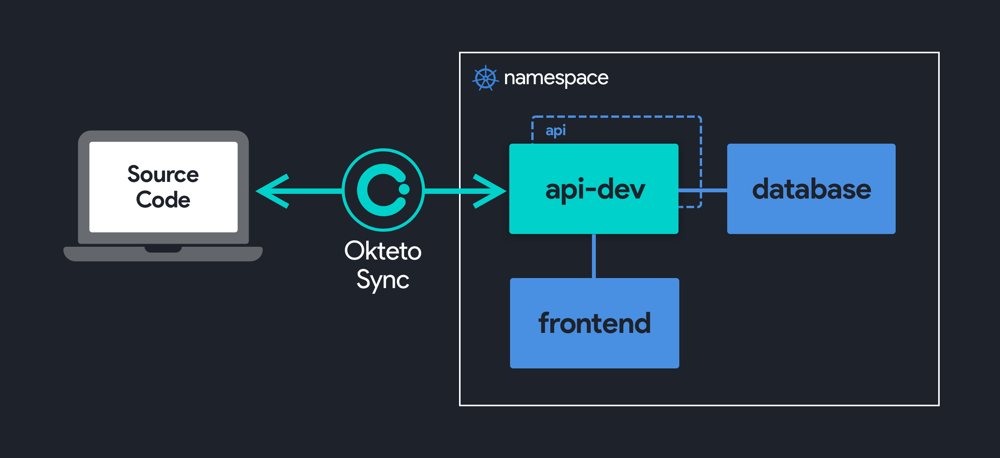

# Okteto: A Tool to Develop Applications on Kubernetes

## Overview

Kubernetes has made it very easy to deploy applications to the cloud at a higher scale than ever, but the development practices have not evolved at the same speed as application deployment patterns.

Today, most developers try to either run parts of the infrastructure locally or just test these integrations directly in the cluster via CI jobs, or the _docker build/redeploy_ cycle. It works, but this workflow is painful and incredibly slow.

`okteto` accelerates the development workflow of Kubernetes applications. You write your code locally and `okteto` detects the changes and instantly updates your Kubernetes applications.

## How it works

Okteto allows you to develop inside a container. When you run `okteto up` your Kubernetes deployment is replaced by a development container that contains your development tools (e.g. maven and jdk, or npm, python, go compiler, debuggers, etc). This development container can be any [docker image](https://okteto.com/docs/reference/development-environment/). The development container inherits the same secrets, configmaps, volumes or any other configuration value of the original Kubernetes deployment.

In addition to that, `okteto up` will:

1. Create a bidirectional file [synchronization service](https://okteto.com/docs/reference/file-synchronization/) to keep your changes up to date between your local filesystem and your development container.
1. Automatic local and remote port forwarding using [SSH](https://okteto.com/docs/reference/ssh-server/), so you can access your cluster services via `localhost` or connect a remote debugger.
1. Give you an interactive terminal to your development container, so you can build, test, and run your application as you would from a local terminal.

All of this (and more) can be configured via a [simple YAML manifest](https://okteto.com/docs/reference/manifest/).

The end result is that the remote cluster is seen by your IDE and tools as a local filesystem/environment. You keep writing your code on your local IDE and as soon as you save a file, the change goes to the development container, and your application instantly updates (taking advantage of any hot-reload mechanism you already have). This whole process happens in an instant. No docker images need to be created and no Kubernetes manifests need to be applied to the cluster.

## Why Okteto

`okteto` has several advantages when compared to more traditional development approaches:

- **Fast inner loop development**: build and run your application using your favorite tools directly from your development container. Native builds are always faster than the _docker build/redeploy_ cycle.
- **Realistic development environment**: your development container reuses the same variables, secrets, sidecars, volumes, etc... than your original Kubernetes deployment. Realistic environments eliminate integration issues.
- **Replicability**: development containers eliminate the need to install your dependencies locally, everything is pre-configured in your development image.
- **Unlimited resources**: get access to the hardware and network of your cluster when developing your application.
- **Deployment independent**: `okteto` decouples deployment from development. You can deploy your application with kubectl, Helm, a serverless framework, or even a CI pipeline and use `okteto up` to develop it. This is especially useful for cloud-native applications where deployment pipelines are not trivial.
- **Works anywhere**: `okteto` works with any Kubernetes cluster, local or remote. `okteto` is also available for macOS, Linux, and Windows.

## Getting started

All you need to get started is to [install the Okteto CLI](https://okteto.com/docs/getting-started/installation/) and have access to a Kubernetes cluster.

You can also use `okteto` with [Okteto Cloud](https://okteto.com/), a **Kubernetes Namespace as a Service** platform where you can deploy your Kubernetes applications and development containers for free.

### Super Quick Start

- Deploy your application on Kubernetes.
- Run `okteto init` from the root of your git repository to inspect your code and generate your [Okteto manifest](https://okteto.com/docs/reference/manifest/). The Okteto manifest defines your development container.
- Run `okteto up` to deploy your development container.

We created a [few guides to help you get started](https://github.com/okteto/samples) with `okteto` and your favorite programming language.

## Useful links

- [Installation guides](https://okteto.com/docs/getting-started/installation/)
- [CLI reference](https://okteto.com/docs/reference/cli)
- [Okteto manifest reference](https://okteto.com/docs/reference/manifest/)
- [Samples](https://github.com/okteto/samples)
- Frequently asked questions ([FAQs](https://okteto.com/docs/reference/faqs/))
- [Known issues](https://okteto.com/docs/reference/known-issues/)

## Support and Community

Got questions? Have feedback? Join the conversation in our [#okteto](https://kubernetes.slack.com/messages/CM1QMQGS0/) Slack channel! If you don't already have a Kubernetes Slack account, [sign up here](https://slack.k8s.io/).

Follow [@OktetoHQ](https://twitter.com/oktetohq) on Twitter for important announcements.

## Roadmap

We use GitHub [issues](https://github.com/okteto/okteto/issues) to track our roadmap. A [milestone](https://github.com/okteto/okteto/milestones) is created every month to track the work scheduled for that time period. Feedback and help are always appreciated!

## Contributions

We ❤️ contributions big or small. [See our guide](contributing.md) on how to get started.

### Thanks to all our contributors!

[//]: contributor-faces

[//]: contributor-faces
