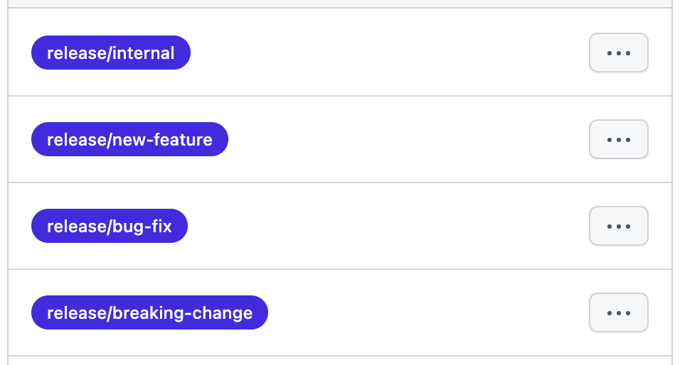

# Contributing to Okteto CLI

Thank you for showing interest in contributing to Okteto CLI! We appreciate all kinds of contributions, suggestions, and feedback.

## Code of Conduct

This project adheres to the Contributor Covenant [Code of Conduct](CODE_OF_CONDUCT.md). By participating, you are expected to uphold this code. Please report any unacceptable behavior to hello@okteto.com.

## Ways To Contribute

### Reporting Issues

Reporting issues is a great way to help the project! This isn't just limited to reporting bugs but can also include feature requests or suggestions for improvements in current behavior. We use [GitHub issues](https://github.com/okteto/okteto/issues) for tracking all such things. But if you want to report a sensitive security issue or a security exploit, you can directly contact the project maintainers on hello@okteto.com or via [a Twitter DM](https://twitter.com/oktetoHQ).

### Contributing Code

When contributing features or bug fixes to Okteto CLI, it'll be helpful to keep the following things in mind:

- Communicating your changes before you start working
- Including unit tests whenever relevant
- Making sure your code passes the [lint checks](#linting)
- Signing off on all your git commits by running `git commit -s`
- Documenting all Go public types, structs, and functions in your code

Discussing your changes with the maintainers before implementation is one of the most important steps, as this sets you in the right direction before you begin. The best way to communicate this is through a detailed GitHub issue. Another way to discuss changes with maintainers is using the [#okteto](https://kubernetes.slack.com/messages/CM1QMQGS0/) channel on the Kubernetes slack.

#### Making a Pull Request

The following steps will walk you through the process of opening your first pull request:

##### Fork the Repository

Head over to the project repository on GitHub and click the **"Fork"** button. This allows you to work on your own copy of the project without being affected by the changes on the main repository. Once you've forked the project, clone it using:

```
git clone https://github.com/YOUR-USERNAME/okteto.git
```

##### Create a Branch

Creating a new branch for each feature/bugfix on your project fork is recommended. You can do this using:

```
git checkout -b <branch-name>
```

##### Commit and Push Your Changes

Once you've made your changes, you can stage them using:

```
git add .
```

After that, you'll need to commit them. For contributors to certify that they wrote or otherwise have the right to submit the code they are contributing to the project, we require them to acknowledge this by signing their work, which indicates they agree to the DCO found [here](https://developercertificate.org/).

To sign your work, just add a line like this at the end of your commit message:

```
Signed-off-by: Cindy Lopez <cindy.lopez@okteto.com>
```

This can easily be done with the `-s' command-line option to append this automatically to your commit message.

```
git commit -s -m 'Meaningful commit message'
```

> In order to use the `-s` flag for auto signing the commits, you'll need to set your `user.name`and`user.email` git configs

Finally, you can push your changes to GitHub using:

```
git push origin <branch-name>
```

Once you do that and visit the repository, you should see a button on the GitHub UI prompting you to make a PR.

##### Pull Request Labels

In order to assist the team in generating quality release notes, all PRs must have the appropriate labels based on the scope of the change. One of the following labels must be applied to Pull Requests:



The `release/internal` label indicates that the change is associated with contents in the repo that are not associated with any code release. This would include updates to docs or tests in the repo which are not included in the release binaries.

If a pull request includes a new feature that does not affect existing feature sets then you'd add the `release/new-feature` label.

Pull requests containing bug fixes should have the `release/bug-fix` label.

Any change that breaks, or significantly alters, current behavior should be labeled with `release/breaking-change`.

If a pull request does not have one of these labels checks will fail and PR merging will be blocked. If you're unsure which label to apply you are still more than welcome to open the PR and a team member can help identify the correct label during the review process.

## Development Guide

Okteto is developed using the [Go](https://golang.org/) programming language. The current version of Go being used is [v1.21](https://go.dev/doc/go1.21). It uses go modules for dependency management.

### Building

Once you've made your changes, you might want to build a binary of the Okteto CLI containing your changes to test them out. This can be done by running the following command at the root of the project:

```
make
```

This will create the `okteto` binary in the `bin` folder. You can execute the binary by running the following:

```
bin/okteto
```

After you make more changes, simply run `make` again to recompile your changes.

### Executing

In order to execute the `okteto` binary locally, you can do this manually by creating a copy of it to your project directory.

However, there's an easy and preferred way for doing this by creating an `alias` using the following command:

```
alias <alias-name> = /path/to/okteto/binary
```

This will make sure the `alias-name` is in sync with your okteto binary. However, this is a temporary alias. If you'd like to create a permanent alias, you can read more about it [here](https://www.freecodecamp.org/news/how-to-create-your-own-command-in-linux/).

**Note:** Don't use `alias-name` as _okteto_ since the actual okteto CLI tool installed locally will get in conflict with executable `okteto` binary.

### Testing

Unit tests for the project can be executed by running:

```
make test
```

This command will run all the unit tests, will try to detect race conditions, and will generate a test coverage report.

Integration tests can be executed by running:

```
make integration
```

These tests will use your Kubernetes context to create a namespace and all the required k8s resources.

### Linting

Before making a PR, we recommend contributors to run a lint check on their code by running:

```
make lint
```

This command will run `golangci-lint` for the repository and raise any issue that might appear. When the branch is pushed to remote, a workflow will run also this lint tool.

> You will need to download these tools in order to run the lint locally
>
> - [golangci-lint](https://golangci-lint.run/usage/install/#local-installation)
>
> We recommend to have an [integration](https://golangci-lint.run/usage/integrations/) with your IDE so that golangci-lint is used as default linter

We also recommend to install `pre-commit` hooks before opening a PR.

> - [pre-commit](https://pre-commit.com/#installation)

Once downloaded, run `pre-commit install` to install the hooks and before the commit is done, the checks will be run.
