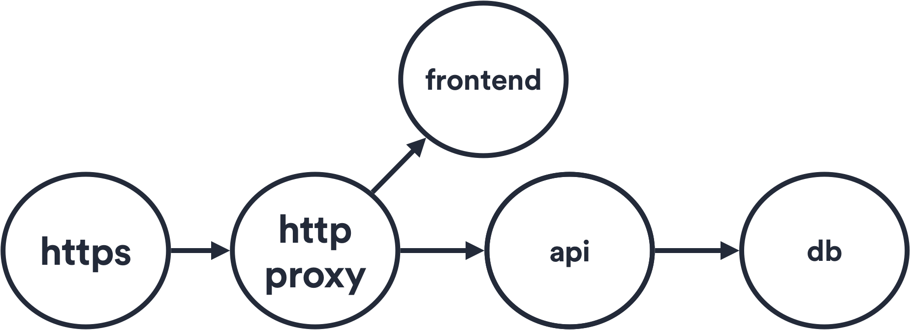
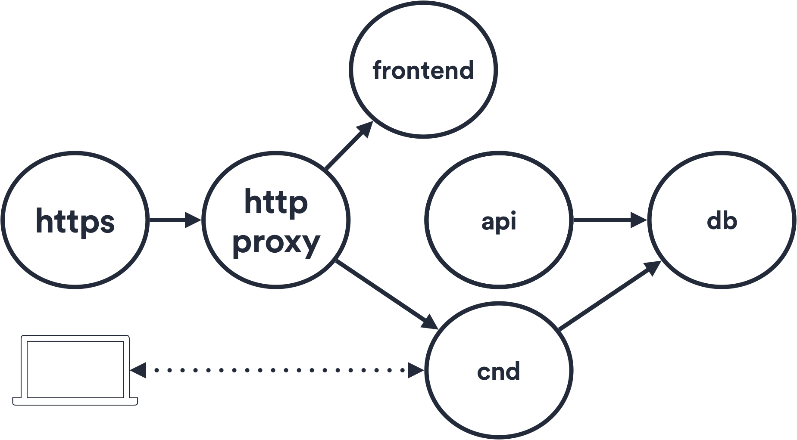

## How does CND work?

This is how a standard dev environment looks like:

&nbsp;

And this how it looks after converting it into a cloud native environment:

&nbsp;

The **cnd** container duplicates the manifest of the **api** pod, so it is fully integrated with every Kubernetes feature.

Local changes are synched to the **cnd** container via `syncthing`. As you save locally, it will be automatically synched in your **cnd** container in seconds.
