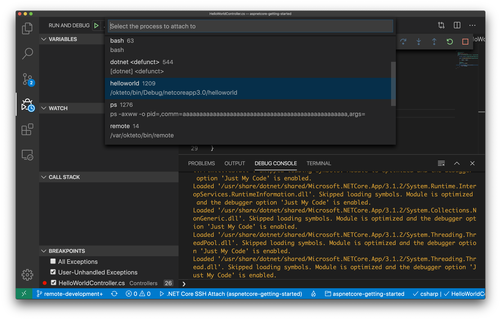

# Getting Started with Okteto and ASP.NET

This tutorial will show you how to develop and debug an ASP.NET application using Okteto

## Step 1: Deploy the ASP.NET Sample App

Run the following command to deploy the ASP.NET Sample App:

```bash
kubectl apply -f k8s.yml
```

```bash
deployment.apps/hello-world created
service/hello-world created
```

## Step 2: Activate your development container

The [dev section](https://www.okteto.com/docs/reference/okteto-manifest/#dev-object-optional) of the Okteto Manifest defines how to activate a development container for the ASP.NET Sample App:

```yaml
dev:
  hello-world:
    image: okteto/aspnetcore-getting-started:dev
    command: bash
    sync:
      - .:/src
    environment:
      - ASPNETCORE_ENVIRONMENT=Development
    remote: 2222
    forward:
      - 5000:5000
```

The `hello-world` key matches the name of the hello world Deployment. The meaning of the rest of fields is:

- `image`: the image used by the development container (built from this [Dockerfile](Dockerfile)).
- `command`: the start command of the development container.
- `sync`: the folders that will be synchronized between your local machine and the development container.
- `environment`: the environment variables added or overwritten in your development container.
- `remote`: the local port to use for SSH communication with your development environment.
- `forward`: a list of ports to forward from your development container to localhost in your machine. This is needed to access the port 5000 of your application on localhost.

Also, note that there is a `.stignore` file to indicate which files shouldn't be synchronized to your development container.
This is useful to avoid synchronizing binaries, build artifacts, or git metadata.

Next, execute the following command to activate your development container:

```bash
okteto up
```

```bash
 ✓  Images successfully pulled
 ✓  Files synchronized
    Namespace: cindy
    Name:      hello-world
    Forward:   5000 -> 5000

Welcome to your development container. Happy coding!
cindy:hello-world src>
```

Working in your development container is the same as working on your local machine.
Start the application by running the following command:

```bash
cindy:hello-world src> dotnet watch run
```

```bash
dotnet watch ⌚ Polling file watcher is enabled
dotnet watch 🔥 Hot reload enabled. For a list of supported edits, see https://aka.ms/dotnet/hot-reload.
  💡 Press "Ctrl + R" to restart.
dotnet watch 🔧 Building...
  Determining projects to restore...
  All projects are up-to-date for restore.
  helloworld -> /src/bin/Debug/netcoreapp6.0/helloworld.dll
dotnet watch 🚀 Started
warn: Microsoft.AspNetCore.Server.Kestrel[0]
      Overriding address(es) 'https://localhost:5001, http://localhost:5000'. Binding to endpoints defined via IConfiguration and/or UseKestrel() instead.
info: Microsoft.Hosting.Lifetime[14]
      Now listening on: http://0.0.0.0:5000
dotnet watch 🌐 Unable to launch the browser. Navigate to http://0.0.0.0:5000
info: Microsoft.Hosting.Lifetime[0]
      Application started. Press Ctrl+C to shut down.
info: Microsoft.Hosting.Lifetime[0]
      Hosting environment: Development
info: Microsoft.Hosting.Lifetime[0]
      Content root path: /src
```

Open your browser and load the page `http://localhost:5000` to test that your application is running.
You should see the message:

```bash
Hello world!
```

## Step 3: Remote Development with Okteto

Open the file `Controllers/HelloWorldController.cs` in your favorite local IDE and modify the response message on line 25 to be _Hello world from Okteto!_. Save your changes.

```csharp
        [HttpGet]
        public string Get()
        {
             return "Hello world from Okteto!";
        }
```

Take a look at the development container shell and notice how the changes are detected by `dotnet watch run` and automatically built and reloaded.

```bash
info: Microsoft.Hosting.Lifetime[0]
      Application is shutting down...
watch : Exited
watch : File changed: /src/Controllers/HelloWorldController.cs
watch : Started
info: Microsoft.Hosting.Lifetime[0]
      Now listening on: http://0.0.0.0:5000
info: Microsoft.Hosting.Lifetime[0]
      Application started. Press Ctrl+C to shut down.
info: Microsoft.Hosting.Lifetime[0]
      Hosting environment: Development
info: Microsoft.Hosting.Lifetime[0]
            Content root path: /src
```

Go back to the browser and reload the page. Your code changes were instantly applied. No commit, build, or push required 😎!

## Step 4: Remote debugging with Okteto

Okteto enables you to debug your applications directly from your favorite IDE. Let's take a look at how that works in VS Code using the VS dotnet debugger.

For this step, we're going to use the `C#` extension for VS Code. If you don't have it, you can [install it here](https://marketplace.visualstudio.com/items?itemName=ms-vscode.csharp#review-details). You might need to restart your VS Code instance.

Open `HelloWorldController.cs` in VS Code, set a breakpoint on line `26` and press `F5`. VS Code will connect to your development container via SSH and give you a list of processes you can attach to. Scroll through the list and select the `helloworld` process, as shown below (you can also type `helloworld` in the search bar directly).



Once you select the process, VS Code will switch to debug view, launch the debugger, and attach it to the process you just selected. You'll know it's finished when the status bar at the bottom turns orange.


Go back to the browser and reload the page. As soon as the service receives the request, the execution will halt at your breakpoint and VS Code will jump to the front of the screen. You can then inspect the request, the available variables, etc.


Your code is executing in Okteto, but you can debug it from your local machine without any extra services or tools. Pretty cool no? 😉
