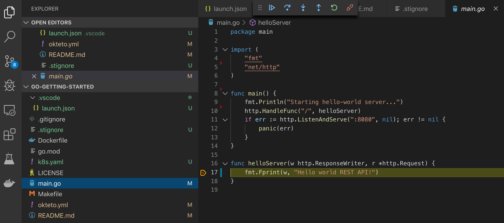

# Getting Started with Go

This tutorial will show you how to develop and debug a Go Sample App with Okteto.

## Step 1: Deploy the Go Sample App

The `k8s.yml` file at the root of this folder contains the Kubernetes manifests to deploy the Go Sample App.
Run the application by executing:

```console
$ kubectl apply -f k8s.yml
```

```
deployment.apps "hello-world" created
service "hello-world" created
```

## Step 2: Activate your development container

The [dev](reference/manifest.mdx#dev-object-optional) section defines how to activate a development container for the Go Sample App:

```yaml
dev:
  hello-world:
    image: okteto/golang:1
    command: bash
    sync:
      - .:/usr/src/app
    volumes:
      - /go
      - /root/.cache
    securityContext:
      capabilities:
        add:
          - SYS_PTRACE
    forward:
      - 8080:8080
      - 2345:2345
```

The `hello-world` key matches the name of the hello world `Deployment`. The meaning of the rest of fields is:

- `image`: the image used by the development container. More information on development images [here](www.okteto.com/docs/reference/development-environments)
- `command`: the start command of the development container
- `sync`: the folders that will be synchronized between your local machine and the development container
- `volumes`: a list of paths in your development container to be mounted as persistent volumes. For example, this can be used to persist the Go cache
- `securityContext`: `SYS_PTRACE` is a capability required by the Go debugger
- `forward`: a list of ports to forward from your development container to locahost in your machine. This is needed to access your application on localhost and to configure the Go debugger

Also, note that there is a `.stignore` file to indicate which files shouldn't be synchronized to your development container.
This is useful to avoid synchronizing binaries, build artifacts, git metadata, or dependencies like the `vendor` folder.

Next, execute the following command to activate your development container:

```console
$ okteto up
```

```console
 i  Development environment 'go-getting-started' already deployed.
 ✓  Images successfully pulled
 ✓  Files synchronized
    Namespace: cindy
    Name:      hello-world
    Forward:   8080 -> 8080
               2345 -> 2345

Welcome to your development container. Happy coding!
cindy:hello-world app>
```

Working in your development container is the same as working on your local machine.
Start the application by running the following command:

```console
cindy:hello-world app> go run main.go
```

```console
Starting hello-world server...
```

Test your application by running the following command:

```console
curl localhost:8080
```

```console
Hello world!
```

## Step 3: Develop directly on Kubernetes

Open the file `main.go` in your favorite local IDE and modify the response message on line 17 to be *Hello world from Kubernetes!*. Save your changes.

```golang
func helloServer(w http.ResponseWriter, r *http.Request) {
	fmt.Fprint(w, "Hello world from Kubernetes!")
}
```

Okteto will synchronize them your development container on Kubernetes.
Cancel the execution of `go run main.go` from the development container shell by pressing `ctrl + c`.
Rerun your application:

```console
cindy:hello-world app> go run main.go
```

```console
Starting hello-world server...
```

Access your applicationto to test it:

```console
curl localhost:8080
```

```console
Hello world from Kubernetes!
```

Your code changes were instantly applied. No commit, build, or push required 😎!

## Step 4: Debug directly on Kubernetes

Okteto enables you to debug your applications directly from your favorite IDE.
Let's take a look at how that works in VS Code, one of the most popular IDEs for Go development.
If you haven't done it yet, install the [Go extension](https://marketplace.visualstudio.com/items?itemName=ms-vscode.Go) available from Visual Studio marketplace.

Cancel the execution of `go run main.go` from the development container shell by pressing `ctrl + c`.
Rerun your application in debug mode:

```console
cindy:hello-world app> dlv debug --headless --listen=:2345 --log --api-version=2
```

```console
API server listening at: [::]:2345
2019-10-17T14:39:24Z info layer=debugger launching process with args: [/usr/src/app/__debug_bin]
```

In your local machine, open VS Code, and install the [Go extension](https://marketplace.visualstudio.com/items?itemName=ms-vscode.Go).

The sample application is already configured for remote debugging.
Open the _Debug_ view in VS Code and run the *Connect to okteto* debug configuration (or just press the F5 shortcut) to start the remote debugger:

```json
{
    "version": "0.2.0",
    "configurations": [
        {
            "name": "Connect to okteto",
            "type": "go",
            "request": "attach",
            "mode": "remote",
            "remotePath": "/usr/src/app",
            "port": 2345,
            "host": "127.0.0.1"
        }
    ]
}
```

> You should be replacing the value of `remotePath` with wherever your application code is.

Add a breakpoint on `main.go`, line 17. Reload the app:

```console
curl localhost:8080
```

The execution will halt at your breakpoint. You can then inspect the request, the available variables, etc...



Your code is executing on Kubernetes, but you can debug it from your local machine without any extra services or tools.
Pretty cool no? 😉
