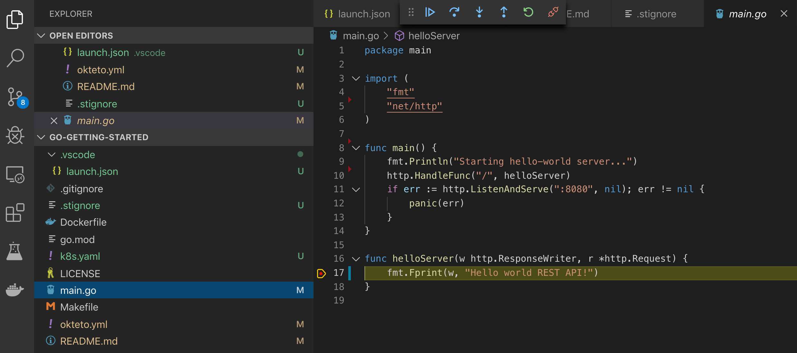

# Getting Started with Okteto and Golang

This tutorial will show you how to develop and debug a Golang application using Okteto

## Step 1: Deploy the Golang Sample App

Run the following command to deploy the Golang Sample App:

```bash
kubectl apply -f k8s.yml
```

```bash
deployment.apps/hello-world created
service/hello-world created
```

## Step 2: Activate your development container

The [dev section](https://www.okteto.com/docs/reference/okteto-manifest/#dev-object-optional) of the Okteto Manifest defines how to activate a development container for the Golang Sample App:

```yaml
dev:
  hello-world:
    image: okteto/golang:1
    command: bash
    sync:
      - .:/usr/src/app
    volumes:
      - /go
      - /root/.cache
    securityContext:
      capabilities:
        add:
          - SYS_PTRACE
    forward:
      - 8080:8080
      - 2345:2345
```

The `hello-world` key matches the name of the hello world Deployment. The meaning of the rest of fields is:

- `image`: the image used by the development container.
- `command`: the start command of the development container.
- `sync`: the folders that will be synchronized between your local machine and the development container.
- `volumes`: a list of paths in your development container to be mounted as persistent volumes. For example, this can be used to persist the Go cache.
- `securityContext`: `SYS_PTRACE` is a capability required by the Go debugger.
- `forward`: a list of ports to forward from your development container to localhost in your machine. This is needed to access the port 8080 of your application on localhost and to configure the Go remote debugger.

Also, note that there is a `.stignore` file to indicate which files shouldn't be synchronized to your development container.
This is useful to avoid synchronizing binaries, build artifacts, git metadata, or dependencies like the `vendor` folder.

Next, execute the following command to activate your development container:

```bash
okteto up
```

```bash
 ✓  Images successfully pulled
 ✓  Files synchronized
    Namespace: cindy
    Name:      hello-world
    Forward:   8080 -> 8080
               2345 -> 2345

Welcome to your development container. Happy coding!
cindy:hello-world app>
```

Working in your development container is the same as working on your local machine.
Start the application by running the following command:

```bash
cindy:hello-world app> go run main.go
```

```bash
Starting hello-world server...
```

Open your browser and load the page `http://localhost:8080` to test that your application is running.
You should see the message:

```bash
Hello world!
```

## Step 3: Remote Development with Okteto

Open the file `main.go` in your favorite local IDE and modify the response message on line 17 to be _Hello world from Okteto!_. Save your changes.

```golang
func helloServer(w http.ResponseWriter, r *http.Request) {
	fmt.Fprint(w, "Hello world from Okteto!")
}
```

Okteto will synchronize your changes to your development container.
Cancel the execution of `go run main.go` from the development container shell by pressing `ctrl + c`.
Rerun your application:

```bash
cindy:hello-world app> go run main.go
```

```bash
Starting hello-world server...
```

Go back to the browser and reload the page. Your code changes were instantly applied. No commit, build, or push required 😎!

## Step 4: Remote debugging with Okteto

Okteto enables you to debug your applications directly from your favorite IDE.
Let's take a look at how that works in VS Code, one of the most popular IDEs for Go development.
If you haven't done it yet, install the [Go extension](https://marketplace.visualstudio.com/items?itemName=ms-vscode.Go) available from Visual Studio marketplace.

Cancel the execution of `go run main.go` from the development container shell by pressing `ctrl + c`.
Rerun your application in debug mode:

```bash
cindy:hello-world app> dlv debug --headless --listen=:2345 --log --api-version=2
```

```bash
API server listening at: [::]:2345
2019-10-17T14:39:24Z info layer=debugger launching process with args: [/usr/src/app/__debug_bin]
```

In your local machine, open VS Code, and install the [Go extension](https://marketplace.visualstudio.com/items?itemName=ms-vscode.Go).

The sample application is already configured for remote debugging.
Open the _Debug_ view in VS Code and run the _Connect to okteto_ debug configuration (or just press the F5 shortcut) to start the remote debugger:

```json
{
  "version": "0.2.0",
  "configurations": [
    {
      "name": "Connect to okteto",
      "type": "go",
      "request": "attach",
      "mode": "remote",
      "remotePath": "/usr/src/app",
      "port": 2345,
      "host": "127.0.0.1"
    }
  ]
}
```

> You should be replacing the value of `remotePath` with wherever your application code is.

Add a breakpoint on `main.go`, line 17. Go back to the browser, and reload the page.
The execution will halt at your breakpoint. You can then inspect the request, the available variables, etc...



Your code is executing in Okteto, but you can debug it from your local machine without any extra services or tools. Pretty cool no? 😉
