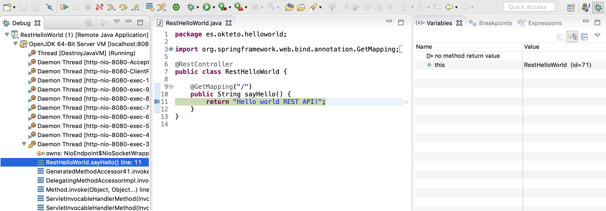

# Getting Started with Java (Gradle)

This tutorial will show you how to develop and debug a Java Sample App with Okteto.

## Step 1: Deploy the Java Sample App

The `k8s.yml` file at the root of this folder contains the Kubernetes manifests to deploy the Java Sample App.
Run the application by executing:

```console
$ kubectl apply -f k8s.yml
```

```
deployment.apps "hello-world" created
service "hello-world" created
```

## Step 2: Activate your development container

The [dev](reference/manifest.mdx#dev-object-optional) section defines how to activate a development container for the Java Sample App:

```
dev:
  hello-world:
    image: okteto/gradle:6.5
    command: bash
    sync:
      - .:/usr/src/app
    forward:
      - 8080:8080
      - 5005:5005
    volumes:
      - /home/gradle/.gradle
```

The `hello-world` key matches the name of the hello world Deployment. The meaning of the rest of fields is:
- `image`: the image used by the development container. More information on development images [here](www.okteto.com/docs/reference/development-environments)
- `command`: the start command of the development container
- `sync`: the folders that will be synchronized between your local machine and the development container
- `forward`: a list of ports to forward from your development container. This is needed to access your application on localhost and to configure the Java debugger
- `volumes`: a list of paths in your development container to be mounted as persistent volumes. This is useful to persist the maven/gradle caches.

Also, note that there is a `.stignore` file to indicate which files shouldn't be synchronized to your development container.
This is useful to avoid synchronizing binaries, build artifacts, or git metadata.

Next, execute the following command to activate your development container:

```console
$ okteto up
```

```console
 ✓  Persistent volume successfully attached
 ✓  Images successfully pulled
 ✓  Files synchronized
    Namespace: cindy
    Name:      hello-world
    Forward:   8080 -> 8080
               5005 -> 5005

Welcome to your development container. Happy coding!
cindy:hello-world app>
```

Working in your development container is the same as working on your local machine.
Start the application by running the following command:

```console
default:hello-world app> gradle bootRun
```

The first time you run the application, Gradle will compile your application. Wait for this process to finish.

Test your application by running the following command:

```console
curl localhost:8080
```

```console
Hello world!
```

## Step 3: Develop directly on Kubernetes

Open `src/main/java/com/okteto/helloworld/RestHelloWorld.java` in your favorite local IDE and modify the response message on line 11 to be *Hello world from Kubernetes!*. Save your changes.

```java
package com.okteto.helloworld;

import org.springframework.web.bind.annotation.GetMapping;
import org.springframework.web.bind.annotation.RestController;

@RestController
public class RestHelloWorld {

	@GetMapping("/")
	public String sayHello() {
		return "Hello world from Kubernetes!";
	}
}
```

Your IDE will auto compile only the necessary `*.class` files and Okteto will synchronize them your development container on Kubernetes.
Take a look at the development container shell and notice how the changes are detected by Spring Boot and automatically hot reloaded.

> Import the `spring-boot-devtools` dependency to automatically restart your Java application whenever a file is changed.

Test your application by running the following command:

```console
curl localhost:8080
```

```console
Hello world from Kubernetes!
```

Your code changes were instantly applied. No commit, build, or push required 😎!

## Step 4: Debug directly on Okteto Cloud

Okteto enables you to debug your applications directly from your favorite IDE. Let's take a look at how that works in Eclipse, one of the most popular IDEs for Java development.

> Add the following JVM arguments in the Gradle/Maven configuration files to enable remote debugging in your Java application:
>
> `-agentlib:jdwp=transport=dt_socket,server=y,suspend=n,address=5005`

Open the _Debug configuration_  dialog, add a new Remote Java Application debug configuration, and point it to `localhost:5005`:


Click the Debug button to start a debugging session. Add a breakpoint on `src/main/java/es/okteto/helloworld/RestHelloWorld.java`, line 11. Go back to the browser and reload the page. The execution will halt at your breakpoint. You can then inspect the request, the available variables, etc...



Your code is executing on Kubernetes, but you can debug it from your local machine without any extra services or tools. Pretty cool no? 😉
