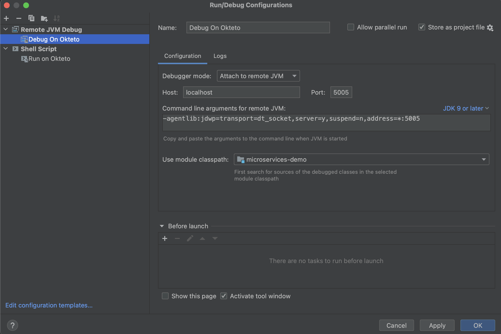
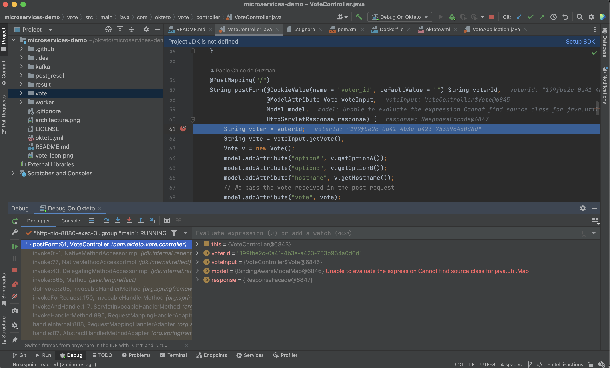

# Getting Started with Okteto and Java (Gradle)

This tutorial will show you how to develop and debug a Java (Gradle) application using Okteto

## Step 1: Deploy the Java (Gradle) Sample App

Run the following command to deploy the Java (Gradle) Sample App:

```bash
kubectl apply -f k8s.yml
```

```bash
deployment.apps/hello-world created
service/hello-world created
```

## Step 2: Activate your development container

The [dev section](https://www.okteto.com/docs/reference/okteto-manifest/#dev-object-optional) of the Okteto Manifest defines how to activate a development container for the Java (Gradle) Sample App:

```yaml
dev:
  hello-world:
    image: okteto/gradle:6.5
    command: bash
    sync:
      - .:/usr/src/app
    forward:
      - 8080:8080
      - 5005:5005
    volumes:
      - /home/gradle/.gradle
```

The `hello-world` key matches the name of the hello world Deployment. The meaning of the rest of fields is:

- `image`: the image used by the development container.
- `command`: the start command of the development container.
- `sync`: the folders that will be synchronized between your local machine and the development container.
- `forward`: a list of ports to forward from your development container. This is needed to access the port 8080 of your application on localhost and to configure the Java remote debugger.
- `volumes`: a list of paths in your development container to be mounted as persistent volumes. This is useful to persist the gradle caches.

Also, note that there is a `.stignore` file to indicate which files shouldn't be synchronized to your development container.
This is useful to avoid synchronizing binaries, build artifacts, or git metadata.

Next, execute the following command to activate your development container:

```bash
okteto up
```

```bash
 ✓  Images successfully pulled
 ✓  Files synchronized
    Namespace: cindy
    Name:      hello-world
    Forward:   8080 -> 8080
               5005 -> 5005

Welcome to your development container. Happy coding!
cindy:hello-world app>
```

Working in your development container is the same as working on your local machine.
Start the application by running the following command:

```bash
default:hello-world app> gradle bootRun
```

The first time you run the application, Gradle will compile your application. Wait for this process to finish.

Open your browser and load the page `http://localhost:8080` to test that your application is running.
You should see the message:

```bash
Hello world!
```

## Step 3: Remote Development with Okteto

Open `src/main/java/com/okteto/helloworld/RestHelloWorld.java` in your favorite local IDE and modify the response message on line 11 to be _Hello world from Okteto!_. Save your changes.

```java
package com.okteto.helloworld;

import org.springframework.web.bind.annotation.GetMapping;
import org.springframework.web.bind.annotation.RestController;

@RestController
public class RestHelloWorld {

	@GetMapping("/")
	public String sayHello() {
		return "Hello world from Okteto!";
	}
}
```

Your IDE will auto compile only the necessary `*.class` files which will be synchronized by Okteto to your remote environment. Take a look at the development container shell and notice how the changes are detected by Spring Boot and automatically hot reloaded.

> Import the `spring-boot-devtools` dependency to automatically restart your Java application whenever a file is changed.

Go back to the browser and reload the page. Your code changes were instantly applied. No commit, build, or push required 😎!

## Step 4: Remote debugging with Okteto

Okteto enables you to debug your applications directly from your favorite IDE. Let's take a look at how that works in IntelliJ, one of the most popular IDEs for Java development.

> Add the following JVM arguments in the Gradle configuration files to enable remote debugging in your Java application:
>
> `-agentlib:jdwp=transport=dt_socket,server=y,suspend=n,address=5005`

### Create the debug configuration on IntelliJ

1. From the main menu, select Run | Edit Configurations.
1. In the Run/Debug Configuration dialog, click + on the toolbar or press `⌘ N`. The list shows the run/debug configuration templates. Select Remote JVM Debug.
1. Specify the run/debug configuration name in the Name field. This name will be shown in the list of the available run/debug configurations.
1. In the Configuration section, specify the parameters listed below:
   - Debugger Mode: `Attach to remote JVM`
   - Host: `localhost`
   - Port: `5005` (this should match the port forwarded on your Okteto manifest file)
   - Command line arguments for remote JVM: `-agentlib:jdwp=transport=dt_socket,server=y,suspend=n,address=*:5005`
1. Apply the changes and close the dialog.



### Start the remote debugging session

Select the debug action you just added, and click on the debug button to start the remote debugging session.

Add a breakpoint on `src/main/java/es/okteto/helloworld/RestHelloWorld.java`, line 11. Go back to the browser and reload the page. The execution will halt at your breakpoint. You can then inspect the request, the available variables, etc...



Your code is executing in your remote development environment, but you can debug it from your local machine without any extra services or tools. Pretty cool no? 😉
