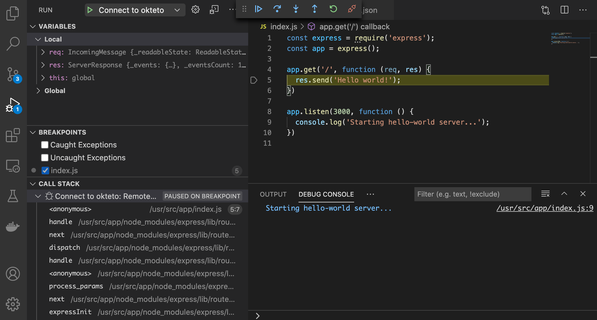

# Getting Started with Okteto and Node.js

This tutorial will show you how to develop and debug a Node.js application using Okteto

## Step 1: Deploy the Node.js Sample App

Run the following command to deploy the Node.js Sample App:

```bash
kubectl apply -f k8s.yml
```

```bash
deployment.apps/hello-world created
service/hello-world created
```

## Step 2: Activate your development container

The [dev section](https://www.okteto.com/docs/reference/okteto-manifest/#dev-object-optional) of the Okteto Manifest defines how to activate a development container for the Node.js Sample App:

```yaml
dev:
  hello-world:
    command: bash
    sync:
      - .:/usr/src/app
    forward:
      - 3000:3000
      - 9229:9229
```

The `hello-world` key matches the name of the hello world Deployment. The meaning of the rest of fields is:

- `command`: the start command of the development container.
- `sync`: the folders that will be synchronized between your local machine and the development container.
- `forward`: a list of ports to forward from your development container to localhost in your machine. This is needed to access the port 3000 of your application on localhost and to configure the Node.js remote debugger.

Also, note that there is a `.stignore` file to indicate which files shouldn't be synchronized to your development container.
This is useful to avoid synchronizing binaries, build artifacts, git metadata, or dependencies like the `node_modules` folder.

Next, execute the following command to activate your development container:

```bash
okteto up
```

```bash
 ✓  Images successfully pulled
 ✓  Files synchronized
    Namespace: cindy
    Name:      hello-world
    Forward:   3000 -> 3000
               9229 -> 9229


Welcome to your development container. Happy coding!
cindy:hello-world app>
```

Working in your development container is the same as working on your local machine.
Start the application in hot-reload mode by running the following command:

```bash
cindy:hello-world app> npm run start
```

```bash
> node-getting-started@1.0.0 start /usr/src/app
> nodemon index.js

[nodemon] 2.0.18
[nodemon] to restart at any time, enter `rs`
[nodemon] watching path(s): *.*
[nodemon] watching extensions: js,mjs,json
[nodemon] starting `node index.js`
Starting hello-world server...
```

Open your browser and load the page `http://localhost:3000` to test that your application is running.
You should see the message:

```bash
Hello world!
```

## Step 3: Remote Development with Okteto

Open the `index.js` file in your favorite local IDE and modify the response message on line 5 to be _Hello world from Okteto!_. Save your changes.

```javascript
res.send('Hello world from Okteto!');
```

Okteto will synchronize your changes to your development container.
Take a look at the development container shell and notice how the changes are detected by `nodemon` and automatically hot reloaded.

```bash
[nodemon] restarting due to changes...
[nodemon] starting `node index.js`
Starting hello-world server...
```

Go back to the browser and reload the page. Your code changes were instantly applied. No commit, build, or push required 😎!

## Step 4: Remote debugging with Okteto

Okteto enables you to debug your applications directly from your favorite IDE.
Let's take a look at how that works in VS Code, one of the most popular IDEs for Node development.
If you haven't done it yet, install the Node.js extension available from Visual Studio marketplace.

Cancel the execution of `nodemon index.js` from the development container shell by pressing `ctrl + c`.
Rerun your application in debug mode:

```bash
cindy:hello-world app> npm run debug
```

```bash
Debugger listening on ws://0.0.0.0:9229/73d8d793-b0c3-4310-86ee-3a42938a5df1
For help, see: https://nodejs.org/en/docs/inspector
```

Open the _Debug_ extension and run the _Connect to okteto_ debug configuration (or press the F5 shortcut):

```json
{
  "version": "0.2.0",
  "configurations": [
    {
      "name": "Connect to okteto",
      "type": "node",
      "request": "attach",
      "address": "localhost",
      "port": 9229,
      "localRoot": "${workspaceFolder}",
      "remoteRoot": "/usr/src/app",
      "skipFiles": ["<node_internals>/**"]
    }
  ]
}
```

> You should be replacing the value of `remoteRoot` with wherever your application code is.

Add a breakpoint on `index.js`, line 5. Go back to the browser and reload the page.
The execution will halt at your breakpoint. You can then inspect the request, the available variables, etc...



Your code is running in Okteto, but you can debug it from your local machine without any extra services or tools. Pretty cool no? 😉
