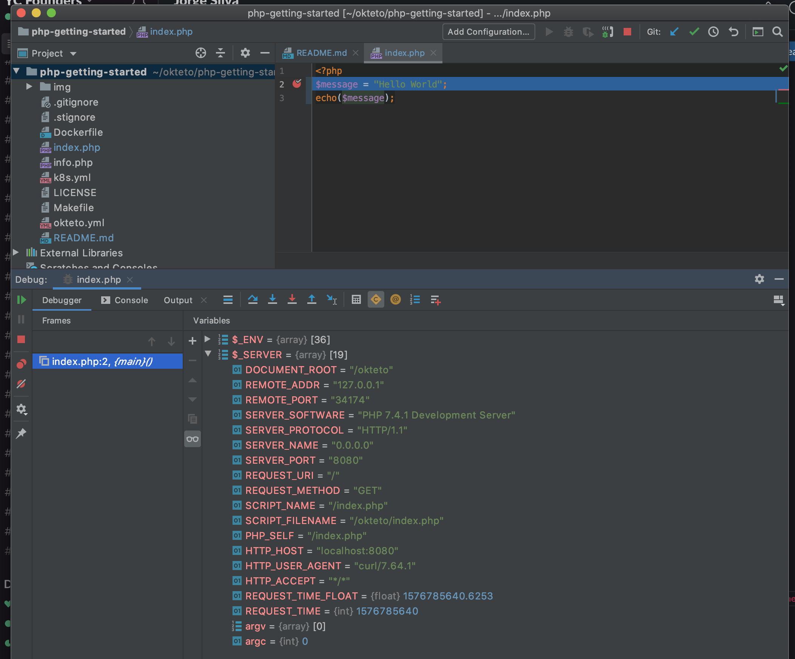

# Getting Started with PHP

This tutorial will show you how to develop and debug a PHP Sample App.

## Step 1: Deploy the PHP Sample App

The `k8s.yml` file at the root of this folder contains the Kubernetes manifests to deploy the PHP Sample App.
Run the application by executing:

```console
$ kubectl apply -f k8s.yml
```

```
deployment.apps "hello-world" created
service "hello-world" created
```

## Step 2: Activate your development container

The [dev](reference/manifest.mdx#dev-object-optional) section defines how to activate a development container for the PHP Sample App:

```
dev:
  hello-world:
    image: okteto/php:7
    command: bash
    sync:
      - .:/app
    forward:
      - 8080:8080
    reverse:
      - 9000:9000
    volumes:
      - /root/.composer/cache
```

The `hello-world` key matches the name of the hello world Deployment. The meaning of the rest of fields is:
- `image`: the image used by the development container. More information on development images [here](www.okteto.com/docs/reference/development-environments)
- `command`: the start command of the development container
- `sync`: the folders that will be synchronized between your local machine and the development container
- `forward`: a list of ports to forward from your development container to localhost in your machine. This is needed to access your application on localhost
- `reverse`: a list of ports to reverse forward from your development container to your local machine
- `volumes`: a list of paths in your development container to be mounted as persistent volumes. For example, this is useful to persist the Composer cache

Also, note that there is a `.stignore` file to indicate which files shouldn't be synchronized to your development container.
This is useful to avoid synchronizing binaries, build artifacts, or git metadata.

Next, execute the following command to activate your development container:

```console
$ okteto up
```

```console
 ✓  Persistent volume successfully attached
 ✓  Images successfully pulled
 ✓  Files synchronized
    Namespace: cindy
    Name:      hello-world
    Forward:   8080 -> 8080
    Reverse:   9000 <- 9000

Welcome to your development container. Happy coding!
cindy:hello-world app>
```

Working in your development container is the same as working on your local machine.
Start the application by running the following command:

```console
cindy:hello-world app> php -S 0.0.0.0:8080
```

```console
[Tue Jul  5 21:04:55 2022] PHP 8.2.0 Development Server (http://0.0.0.0:8080) started
```

Test your application by running the following command:

```console
curl localhost:8080
```

```console
Hello world!
```

## Step 3: Develop directly on Kubernetes

Open the `index.php` file in your favorite local IDE and modify the response message on line 2 to be *Hello world from Kubernetes!*. Save your changes.

```php
<?php
$message = "Hello World from Kubernetes!";
echo($message);
```

Okteto will synchronize your changes to your development container on Kubernetes and PHP will detect the changes automatically and restart the application with the new code.

Test your application by running the following command:

```console
curl localhost:8080
```

```console
Hello world from Kubernetes!
```

Your code changes were instantly applied. No commit, build or push required 😎!

## Step 4: Debug directly ok Kubernetes

Okteto enables you to debug your applications directly from your favorite IDE. Let's take a look at how that works with [PHPStorm](https://www.jetbrains.com/phpstorm/), one of the most popular IDEs for PHP development.

If you haven't already, fire up PHP Storm and load this project there. Once the project is loaded, open `index.php` and set a breakpoint in `line 2`. Click on the `Start Listen PHP Debug Connections` button on the PhpStorm toolbar.

Go back to your browser and reload the page. The execution will automatically halt at the breakpoint.

> If this is the first time you debug this application, the IDE will ask you to confirm the source mapping configuration. Verify the values and click `ok` to continue.

At this point, you're able to inspect the request object, the current values of everything, the contents of `$_SERVER` variable, etc.



Your code is executing on Kubernetes, but you can debug it from your local machine without any extra services or tools. Pretty cool no? 😉
