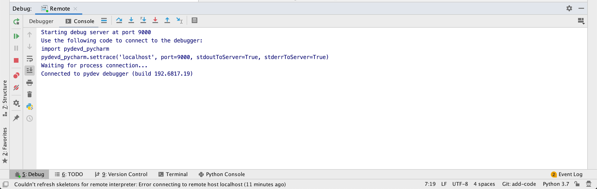
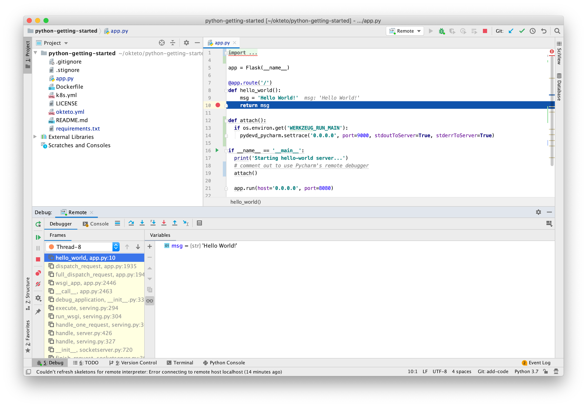

# Getting Started with Python

This tutorial will show you how to develop and debug a Python Sample App with Okteto.

## Step 1: Deploy the Python Sample App

The `k8s.yml` file at the root of this folder contains the Kubernetes manifests to deploy the Python Sample App.
Run the application by executing:

```console
$ kubectl apply -f k8s.yml
```

```
deployment.apps "hello-world" created
service "hello-world" created
```

## Step 2: Activate your development container

The [dev](reference/manifest.mdx#dev-object-optional) section defines how to activate a development container for the Python Sample App:

```
dev:
  hello-world:
    command: bash
    environment:
      - FLASK_ENV=development
    sync:
      - .:/usr/src/app
    forward:
      - 8080:8080
    reverse:
      - 9000:9000
    volumes:
      - /root/.cache/pip
```

The `hello-world` key matches the name of the hello world Deployment. The meaning of the rest of fields is:
- `command`: the start command of the development container
- `sync`: the folders that will be synchronized between your local machine and the development container
- `forward`: a list of ports to forward from your development container to localhost in your machine. This is needed to access your application on localhost
- `reverse`: a list of ports to reverse forward from your development container to your local machine
- `volumes`: a list of paths in your development container to be mounted as persistent volumes. This is useful to persist the pip cache

Also, note that there is a `.stignore` file to indicate which files shouldn't be synchronized to your development container.
This is useful to avoid virtual environments, build artifacts, or git metadata.

Next, execute the following command to activate your development container:

```console
$ okteto up
```

```console
 ✓  Persistent volume successfully attached
 ✓  Images successfully pulled
 ✓  Files synchronized
    Namespace: cindy
    Name:      hello-world
    Reverse:   9000 <- 9000

Welcome to your development container. Happy coding!
cindy:hello-world app>
```

Working in your development container is the same as working on your local machine.
Start the application in development mode by running the following command:

```console
cindy:hello-world app> python app.py
```

```
Starting hello-world server...
 * Serving Flask app "app" (lazy loading)
 * Environment: development
 * Debug mode: on
 * Running on http://0.0.0.0:8080/ (Press CTRL+C to quit)
 ```

Test your application by running the following command:

```console
curl localhost:8080
```

```console
Hello world!
```

## Step 3: Develop directly on Kubernetes

Open the `app.py` file in your favorite local IDE and modify the response message on line 7 to be *Hello world from Kubernetes!*.
Save your changes.

```python
@app.route('/')
def hello_world():
    return 'Hello World from Kubernetes!'
}
```

Okteto will synchronize your changes to your development container on Kubernetes and Flask's auto-reloader will detect the changes automatically and restart the application with the new code.

```console
 * Detected change in '/usr/src/app/app.py', reloading
 * Restarting with stat
Starting hello-world server...
 * Debugger is active!
 * Debugger PIN: 308-916-374
```

Test your application by running the following command:

```console
curl localhost:8080
```

```console
Hello world from Kubernetes!
```

Your code changes were instantly applied. No commit, build, or push required 😎!

## Step 4: Debug directly on Kubernetes

Okteto enables you to debug your applications directly from your favorite IDE.
Let's take a look at how that works in one of python's most popular IDE's, [PyCharm](https://www.jetbrains.com/pycharm/).

> For VS Code users, this [document](https://code.visualstudio.com/docs/python/debugging#_debugging-by-attaching-over-a-network-connection) explains how to configure the debugger with `debugpy`.

First, open the project in PyCharm and remove the comments on `app.py` line `20`.

```python
if __name__ == '__main__':
  print('Starting hello-world server...')
  # comment out to use Pycharm's remote debugger
  attach()

  app.run(host='0.0.0.0', port=8080)
```

Second, launch the [Remote Debug Server](https://www.jetbrains.com/help/pycharm/remote-debugging-with-product.html) by clicking on the Debug button on the top right.
Ensure that the Debug Tool Window shows the `Waiting for process connection...` message. This message will be shown until you launch your app on the development container shell and it connects to the Debug Server.

```console
Starting hello-world server...
 * Serving Flask app "app" (lazy loading)
 * Environment: development
 * Debug mode: on
 * Running on http://0.0.0.0:8080/ (Press CTRL+C to quit)
 * Restarting with stat
Starting hello-world server...
Connecting to debugger...
```

On your local machine, switch to the Debug Tool Window. Once the app connects it will show the connection to the pydev debugger.
Press the `resume` button to let the execution continue.



Add a breakpoint on `app.py`, line 10. Go back to the browser and reload the page.

The execution will halt at your breakpoint. You can then inspect the request, the available variables, etc.



Your code is executing on Kubernetes, but you can debug it from your local machine without any extra services or tools.
Pretty cool no? 😉
