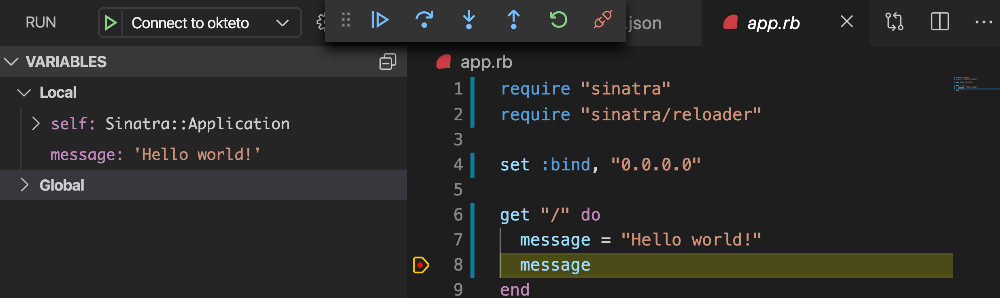

# Getting Started with Okteto and Ruby

This tutorial will show you how to develop and debug a Ruby application using Okteto

## Step 1: Deploy the Ruby Sample App

Run the following command to deploy the Ruby Sample App:

```bash
kubectl apply -f k8s.yml
```

```bash
deployment.apps/hello-world created
service/hello-world created
```

## Step 2: Activate your development container

The [dev section](https://www.okteto.com/docs/reference/okteto-manifest/#dev-object-optional) of the Okteto Manifest defines how to activate a development container for the Ruby Sample App:

```yaml
dev:
  hello-world:
    command: bash
    sync:
      - .:/opt/app/
    forward:
      - 8080:8080
      - 1234:1234
    volumes:
      - /usr/local/bundle/cache
```

The `hello-world` key matches the name of the hello world Deployment. The meaning of the rest of fields is:

- `command`: the start command of the development container.
- `sync`: the folders that will be synchronized between your local machine and the development container.
- `forward`: a list of ports to forward from your development container to localhost in your machine. This is needed to access the port 8080 of your application on localhost and to configure the Ruby remote debugger.
- `volumes`: a list of paths in your development container to be mounted as persistent volumes. For example, this is useful to persist the bundle cache.

Also, note that there is a `.stignore` file to indicate which files shouldn't be synchronized to your development container.
This is useful to avoid synchronizing binaries, build artifacts or git metadata.

Next, execute the following command to activate your development container:

```bash
okteto up
```

```bash
 ✓  Images successfully pulled
 ✓  Files synchronized
    Namespace: cindy
    Name:      hello-world
    Forward:   8080 -> 8080
               1234 -> 1234

Welcome to your development container. Happy coding!
cindy:hello-world app>
```

Working in your development container is the same as working on your local machine.
Start the application in hot-reload mode by running the following command:

```bash
cindy:hello-world app> ruby app.rb
```

```bash
[2022-07-04 16:50:53] INFO  WEBrick 1.6.1
[2022-07-04 16:50:53] INFO  ruby 2.7.6 (2022-04-12) [x86_64-linux]
== Sinatra (v2.0.8.1) has taken the stage on 8080 for production with backup from WEBrick
[2022-07-04 16:50:53] INFO  WEBrick::HTTPServer#start: pid=79 port=8080
```

Open your browser and load the page `http://localhost:8080` to test that your application is running.
You should see the message:

```bash
Hello world!
```

## Step 3: Remote Development with Okteto

Open the `app.rb` file in your favorite local IDE and modify the response message on line 7 to be _Hello world from Okteto!_. Save your changes.

```ruby
get "/" do
  message = "Hello world from Okteto!"
  message
end
```

Okteto will synchronize your changes to your development container in Kubernetes and Sinatra automatically detects them and reloads your application.

Go back to the browser and reload the page. Your code changes were instantly applied. No commit, build, or push required 😎!

## Step 4: Remote debugging with Okteto

Okteto enables you to debug your applications directly from your favorite IDE. Let's take a look at how that works in VS Code, one of the most popular IDEs for Ruby development. If you haven't done it yet, install the [Ruby extension](https://marketplace.visualstudio.com/items?itemName=rebornix.Ruby) available from Visual Studio marketplace. This extension comes with debug definitions covering the default `ruby-debug-ide` client setup.

Now, cancel the execution of `ruby app.rb` from the development container shell by pressing `ctrl + c`. Rerun your application in debug mode:

```bash
cindy:hello-world app> rdebug-ide --host 0.0.0.0 app.rb
```

```bash
Fast Debugger (ruby-debug-ide 0.7.0, debase 0.2.4.1, file filtering is supported) listens on 0.0.0.0:1234
```

Open the _Run_ view in VS Code and run the _Connect to okteto_ debug configuration (or press the F5 shortcut):

```json
{
  "version": "0.2.0",
  "configurations": [
    {
      "name": "Connect to okteto",
      "type": "Ruby",
      "request": "attach",
      "remotePort": "1234",
      "remoteHost": "localhost",
      "remoteWorkspaceRoot": "/opt/app",
      "cwd": "${workspaceRoot}"
    }
  ]
}
```

> You should replace the value of `remoteWorkspaceRoot` with wherever your application code is.

Add a breakpoint on `app.rb`, line 8. Go back to the browser and reload the page. The execution will halt at your breakpoint. You can then inspect the request, the available variables, etc...



Your code is executing in Okteto, but you can debug it from your local machine without any extra services or tools. Pretty cool no? 😉
